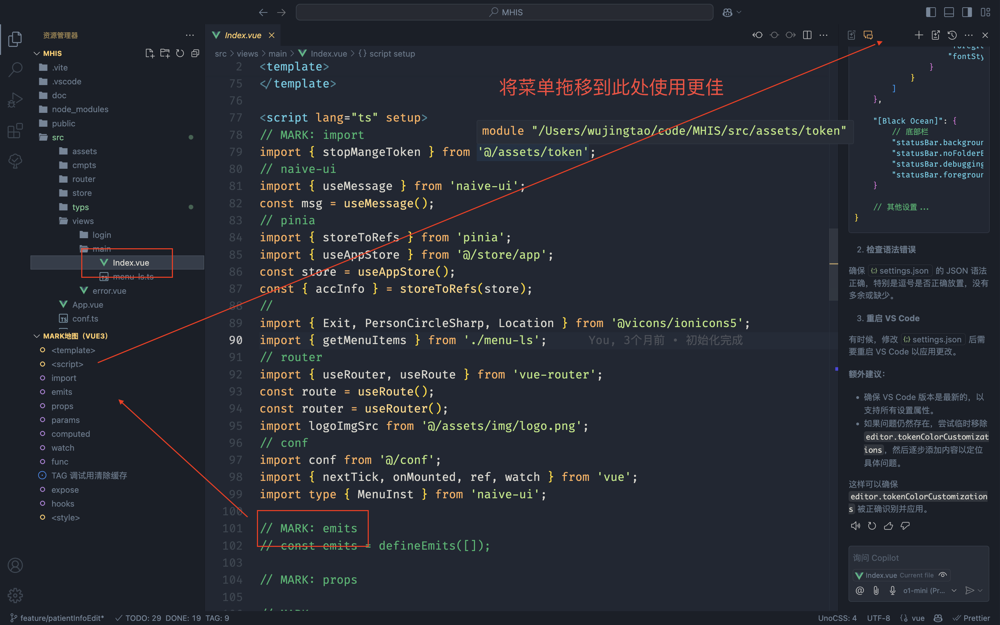
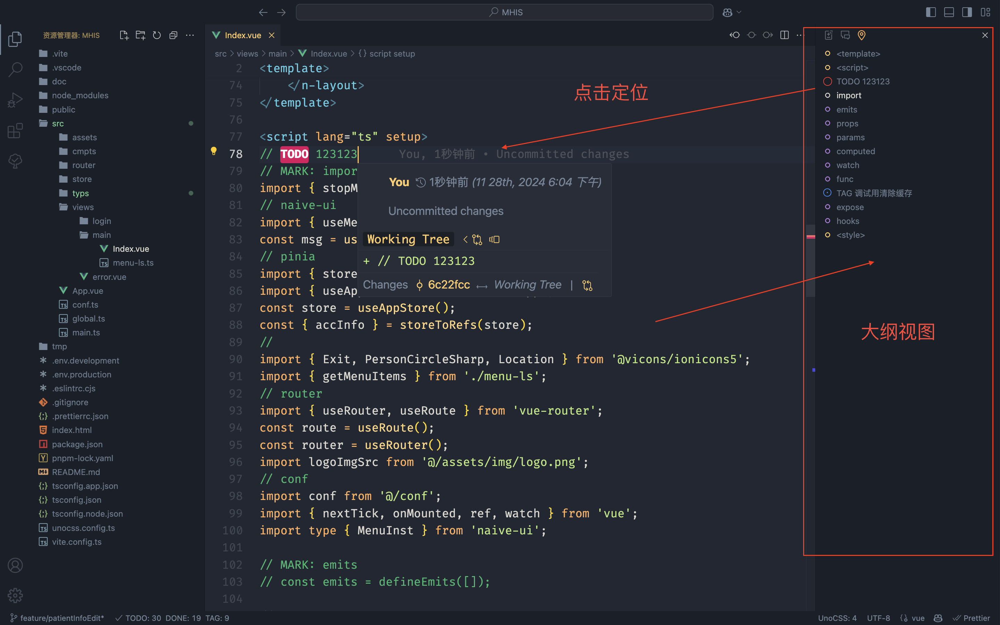

<P>

<span style="font-size:60px;margin-left:16px">Mark Map</span>
</P>

如果你使用 vue3，你会不会也会一时想不起：

- 变量应该写在哪里？

- 函数应该写在哪里？

- 计算属性写在哪里？

- watch 写在哪里？

到头来代码混乱不堪。想做点啥，无处落脚。

Mark Map 是一个 VS Code 扩展，用于在代码中管理注释，并以列表视图的形式显示，我称之为注释大纲视图。

## 功能

- 自动解析代码中的
  > `// MARK:` > `// TODO` > `// TAG` > `// DONE`

注释，并在大纲视图中显示。

- 主要解决 vue3 程序文件结构混乱的问题。
- 点击大纲视图中的项，可以快速跳转到对应的代码行。
- 因此使用此插件需要在 vue 中使用注释划分代码块，例如：

```vue
<!--  -->
<template>
  <div></div>
</template>

<script lang="ts" setup>
// MARK: import
import { onMounted } from "vue";

// MARK: emits
// const emits = defineEmits([]);

// MARK: props
// const props=defineProps({});

// MARK:interface

// MARK: params
// const loading = ref(false);

// MARK: computed

// MARK: watch

// MARK: func
/** @description 更新 */
const rfsPage = async () => {};

// MARK: expose

// MARK: hooks
onMounted(() => {
  rfsPage();
});
</script>

<style lang="scss" scoped></style>
```

## 安装

1. 打开 VS Code。
2. 在插件商店中搜索 `Mark Map`。
3. 点击安装按钮。

## 使用方法

1. 打开一个包含 `MARK:` 注释的代码文件。
2. 在活动栏中找到 `Mark Map活动栏` （类似地图定位图标）并点击。
3. 在大纲视图中查看解析出的注释，并点击跳转到对应的代码行。




